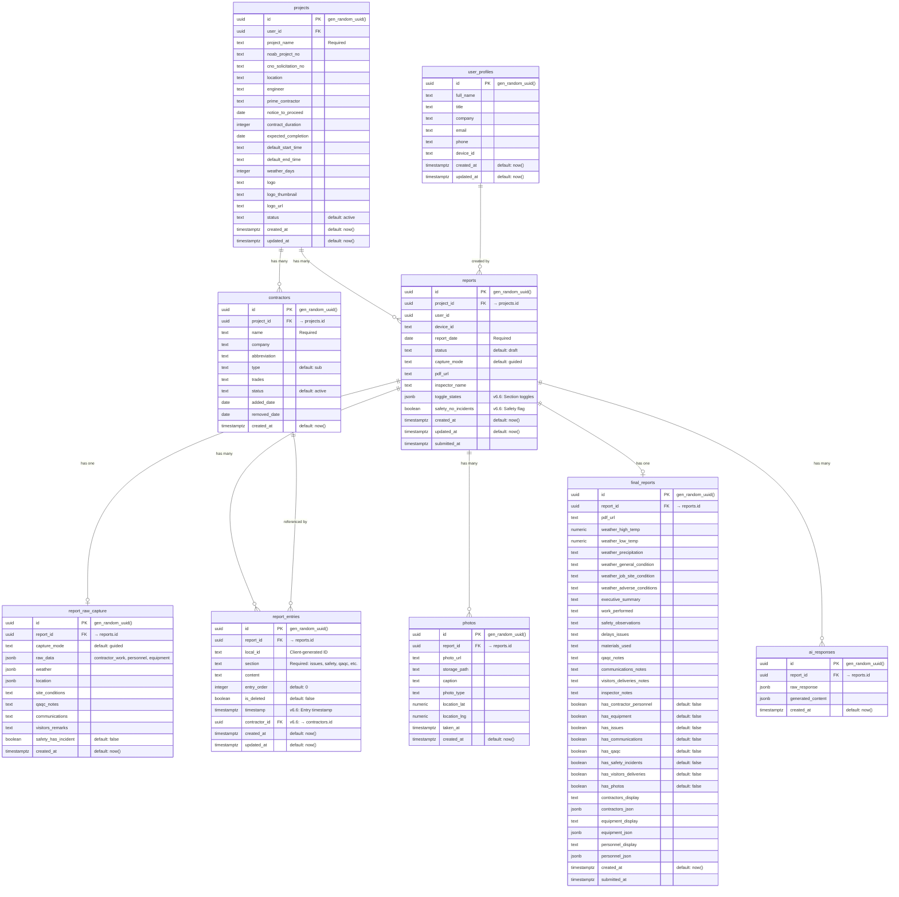

# FieldVoice Pro v6.6 - Data Architecture

**Last Updated:** 2026-01-29  
**Version:** 6.6  
**Supabase Project:** FieldVoice-Pro-v66 (ref: `wejwhplqnhciyxbinivx`)

---

## Table of Contents

1. [Entity Relationship Diagram (ERD)](#1-entity-relationship-diagram-erd)
2. [localStorage Structure](#2-localstorage-structure)
3. [Data Flow Diagram](#3-data-flow-diagram)
4. [Sync Function Reference](#4-sync-function-reference)
5. [Field Mapping Matrix](#5-field-mapping-matrix)

---

## 1. Entity Relationship Diagram (ERD)



### Key Relationships

| Parent Table | Child Table | Relationship | FK Column |
|--------------|-------------|--------------|-----------|
| `projects` | `reports` | 1:N | `project_id` |
| `projects` | `contractors` | 1:N | `project_id` |
| `reports` | `report_entries` | 1:N | `report_id` |
| `reports` | `report_raw_capture` | 1:1 | `report_id` |
| `reports` | `photos` | 1:N | `report_id` |
| `reports` | `final_reports` | 1:1 | `report_id` |
| `reports` | `ai_responses` | 1:N | `report_id` |
| `contractors` | `report_entries` | 1:N | `contractor_id` |

### New Columns (v6.6)

| Table | Column | Type | Purpose |
|-------|--------|------|---------|
| `reports` | `toggle_states` | JSONB | Stores Yes/No toggle states for sections |
| `reports` | `safety_no_incidents` | BOOLEAN | Quick access to safety status |
| `report_entries` | `timestamp` | TIMESTAMPTZ | When the entry was created by user |
| `report_entries` | `contractor_id` | UUID (FK) | Links work entries to specific contractors |

---

## 2. localStorage Structure

### Storage Keys (from `storage-keys.js`)

```javascript
const STORAGE_KEYS = {
    ACTIVE_PROJECT_ID: 'fvp_active_project_id',
    CURRENT_REPORTS: 'fvp_current_reports',      // Map of reportId → report data
    USER_SETTINGS: 'fvp_user_settings',
    SYNC_QUEUE: 'fvp_sync_queue',                // Offline sync queue
    CAPTURE_MODE: 'fvp_capture_mode',
    PROJECTS_CACHE: 'fvp_projects_cache',
    CONTRACTORS_CACHE: 'fvp_contractors_cache'
};
```

### Guided Mode Report Object

```javascript
{
    // Identifiers
    projectId: "uuid",
    reportDate: "YYYY-MM-DD",
    captureMode: "guided",
    lastSaved: "ISO timestamp",

    // Meta
    meta: {
        createdAt: "ISO timestamp",
        version: 2,
        naMarked: {
            issues: false,
            photos: false
        },
        captureMode: "guided",
        status: "draft"  // draft | refined | submitted
    },

    // Weather & Site
    weather: {
        highTemp: "72",
        lowTemp: "58",
        precipitation: "0.00\"",
        generalCondition: "Clear",
        jobSiteCondition: "Dry and workable",
        adverseConditions: "N/A"
    },

    // Legacy fields (for backward compatibility)
    freeformNotes: "",
    workSummary: "",
    siteConditions: "",
    issuesNotes: [],           // Legacy array format
    safetyNoIncidents: false,
    safetyHasIncidents: false,
    safetyNotes: [],           // Legacy array format
    qaqcNotes: [],
    communications: "",
    visitorsRemarks: "",
    additionalNotes: "",

    // Contractor Work (per-contractor activities)
    activities: [
        {
            contractorId: "uuid",
            noWork: false,
            narrative: "Concrete pour section A",
            equipmentUsed: "",
            crew: ""
        }
    ],

    // Personnel Counts
    operations: [
        {
            contractorId: "uuid",
            superintendents: 1,
            foremen: 2,
            operators: 3,
            laborers: 10,
            surveyors: 0,
            others: 0
        }
    ],

    // Equipment
    equipment: [],              // Legacy format
    equipmentRows: [            // v6.6 structured format
        {
            id: "local-uuid",
            description: "CAT 320 Excavator",
            quantity: 1,
            hoursUsed: 8,
            notes: ""
        }
    ],

    // Photos
    photos: [
        {
            id: "local-uuid",
            storagePath: "reports/uuid/photo.jpg",
            url: "https://...",
            caption: "Foundation work",
            timestamp: "ISO timestamp",
            date: "1/29/2026",
            time: "10:30 AM",
            gps: { lat: 29.9511, lng: -90.0715 },
            fileName: "photo.jpg"
        }
    ],

    // Reporter Info
    reporter: {
        name: "John Smith"
    },

    // Overview
    overview: {
        date: "1/29/2026",
        startTime: "7:00 AM",
        completedBy: "John Smith",
        projectName: "NOLA Street Improvements"
    },

    // v6: Entry-based Notes (replaces legacy arrays)
    entries: [
        {
            id: "local-uuid",
            section: "issues",           // issues | safety | qaqc | communications | visitors | contractor_work
            content: "Delay due to weather",
            timestamp: "ISO timestamp",
            contractorId: null           // Only for contractor_work section
        }
    ],

    // v6: Toggle States
    toggleStates: {
        communications_made: true,       // Yes/No for communications
        qaqc_performed: true,           // Yes/No for QA/QC
        visitors_present: false,         // Yes/No for visitors
        personnel_onsite: true          // Yes/No for personnel
    }
}
```

### Freeform Mode Report Object

```javascript
{
    // Identifiers (same as guided)
    projectId: "uuid",
    reportDate: "YYYY-MM-DD",
    captureMode: "freeform",
    lastSaved: "ISO timestamp",

    // Meta
    meta: {
        createdAt: "ISO timestamp",
        version: 2,
        naMarked: {},
        captureMode: "freeform",
        status: "draft"
    },

    // Weather (auto-fetched)
    weather: {
        highTemp: "72",
        lowTemp: "58",
        precipitation: "0.00\"",
        generalCondition: "Clear"
    },

    // Legacy single-string notes (for migration)
    freeformNotes: "",

    // v6.6: Timestamped Freeform Entries
    freeform_entries: [
        {
            id: "local-uuid",
            content: "Started work at 7am. Concrete pour for section A.",
            timestamp: "ISO timestamp"
        }
    ],

    // v6.6: Visual Checklist (quick toggles)
    freeform_checklist: {
        safety_confirmed: true,
        weather_recorded: true,
        photos_taken: false,
        personnel_counted: true
    },

    // Photos (same structure as guided)
    photos: [],

    // Overview
    overview: {
        date: "1/29/2026",
        startTime: "7:00 AM",
        completedBy: "John Smith"
    },

    // Reporter
    reporter: {
        name: "John Smith"
    }
}
```

---

## 3. Data Flow Diagram


### Sync Timing

| Event | localStorage | Supabase | Destination Table(s) |
|-------|-------------|----------|---------------------|
| Entry created/edited | Immediate | 2s debounce | `report_entries` |
| Toggle changed | Immediate | On Finish | `reports.toggle_states` |
| Photo captured | Immediate | Immediate | `photos`, Storage bucket |
| Form field changed | 500ms debounce | On Finish | `reports`, `report_raw_capture` |
| **Finish clicked** | N/A | Immediate | All tables |
| **Submit clicked** | N/A | Immediate | `final_reports` |

### Function Call Chain

```
User types entry → createEntry() → saveReport() → saveToLocalStorage()
                                 → queueEntryBackup() → [2s] → backupEntry() → Supabase

User clicks Finish → processReport() → saveReportToSupabase()
                                     → toSupabaseReport() → reports table
                                     → saveRawCapture() → report_raw_capture table
                                     → backupAllEntries() → report_entries table
                                     → callProcessWebhook() → n8n
```

---

## 4. Sync Function Reference

| Function | File | Trigger | Destination Table | Notes |
|----------|------|---------|-------------------|-------|
| `queueEntryBackup()` | sync-manager.js | Entry created/updated | `report_entries` | 2s debounce |
| `backupEntry()` | sync-manager.js | After debounce | `report_entries` | Single entry upsert |
| `backupAllEntries()` | sync-manager.js | Finish clicked | `report_entries` | Batch upsert |
| `saveReportToSupabase()` | quick-interview.js | Finish clicked | `reports`, `report_raw_capture` | Main save function |
| `uploadPhotoToSupabase()` | quick-interview.js | Photo captured | `photos`, Storage | Immediate |
| `deletePhotoFromSupabase()` | quick-interview.js | Photo deleted | `photos`, Storage | Immediate |
| `syncReport()` | sync-manager.js | Offline queue | `reports` | Retry logic |
| `syncRawCapture()` | sync-manager.js | Offline queue | `report_raw_capture` | Retry logic |
| `toSupabaseReport()` | supabase-utils.js | Called by save | N/A | Transform function |
| `toSupabaseEntry()` | supabase-utils.js | Called by backup | N/A | Transform function |
| `toSupabaseRawCapture()` | supabase-utils.js | Called by save | N/A | Transform function |
| `toSupabasePhoto()` | supabase-utils.js | Called by upload | N/A | Transform function |
| `fromSupabaseReport()` | supabase-utils.js | Load report | N/A | Transform function |
| `fromSupabaseEntry()` | supabase-utils.js | Load entries | N/A | Transform function |
| `reconstructReportFromSupabase()` | quick-interview.js | Page load | N/A | Full report reconstruction |

### Offline Queue Processing

```javascript
// sync-manager.js
processOfflineQueue() {
    // Process queued items when back online
    // Types: ENTRY_BACKUP, REPORT_SYNC, RAW_CAPTURE_SYNC
}
```

---

## 5. Field Mapping Matrix

### reports table

| localStorage Path | Supabase Column | Type | Notes |
|-------------------|-----------------|------|-------|
| `projectId` | `project_id` | UUID | FK to projects |
| `reportDate` | `report_date` | DATE | Required |
| `meta.status` | `status` | TEXT | draft/refined/submitted |
| `meta.captureMode` | `capture_mode` | TEXT | guided/freeform |
| `overview.completedBy` | `inspector_name` | TEXT | |
| `toggleStates` | `toggle_states` | JSONB | v6.6 |
| `safety.noIncidents` | `safety_no_incidents` | BOOLEAN | v6.6 |

### report_entries table

| localStorage Path | Supabase Column | Type | Notes |
|-------------------|-----------------|------|-------|
| `entries[].id` | `local_id` | TEXT | Client-generated |
| `entries[].section` | `section` | TEXT | issues/safety/qaqc/etc |
| `entries[].content` | `content` | TEXT | |
| `entries[].timestamp` | `timestamp` | TIMESTAMPTZ | v6.6 |
| `entries[].contractorId` | `contractor_id` | UUID | v6.6, FK to contractors |
| (auto) | `entry_order` | INTEGER | Calculated on save |
| (auto) | `is_deleted` | BOOLEAN | Soft delete flag |

### report_raw_capture table

| localStorage Path | Supabase Column | Type | Notes |
|-------------------|-----------------|------|-------|
| `meta.captureMode` | `capture_mode` | TEXT | |
| `weather` | `weather` | JSONB | Full weather object |
| `siteConditions` | `site_conditions` | TEXT | |
| `activities[]` | `raw_data.contractor_work` | JSONB | Nested in raw_data |
| `operations[]` | `raw_data.personnel` | JSONB | Nested in raw_data |
| `equipment[]` | `raw_data.equipment_usage` | JSONB | Nested in raw_data |
| `safety.hasIncidents` | `safety_has_incident` | BOOLEAN | |

### photos table

| localStorage Path | Supabase Column | Type | Notes |
|-------------------|-----------------|------|-------|
| `photos[].id` | `id` | UUID | Server-generated on insert |
| `photos[].storagePath` | `storage_path` | TEXT | Path in Storage bucket |
| `photos[].url` | `photo_url` | TEXT | Public URL |
| `photos[].caption` | `caption` | TEXT | |
| `photos[].timestamp` | `taken_at` | TIMESTAMPTZ | |
| `photos[].gps.lat` | `location_lat` | NUMERIC | |
| `photos[].gps.lng` | `location_lng` | NUMERIC | |

### Section Names Mapping

| localStorage Section | `report_entries.section` | Toggle State Key |
|---------------------|-------------------------|------------------|
| Issues & Delays | `issues` | N/A (always visible) |
| Safety | `safety` | N/A (checkbox based) |
| QA/QC Testing | `qaqc` | `qaqc_performed` |
| Communications | `communications` | `communications_made` |
| Visitors/Deliveries | `visitors` | `visitors_present` |
| Contractor Work | `contractor_work` | N/A |
| Personnel | `personnel` | `personnel_onsite` |

---

## Appendix: Unique Constraints

| Table | Constraint | Columns | Purpose |
|-------|-----------|---------|---------|
| `reports` | `reports_project_date_key` | `project_id`, `report_date` | One report per project per day |
| `report_entries` | `report_entries_report_local_key` | `report_id`, `local_id` | Dedup entries by local ID |

---

*Document generated from codebase analysis of FieldVoice-Pro-v6.6*
